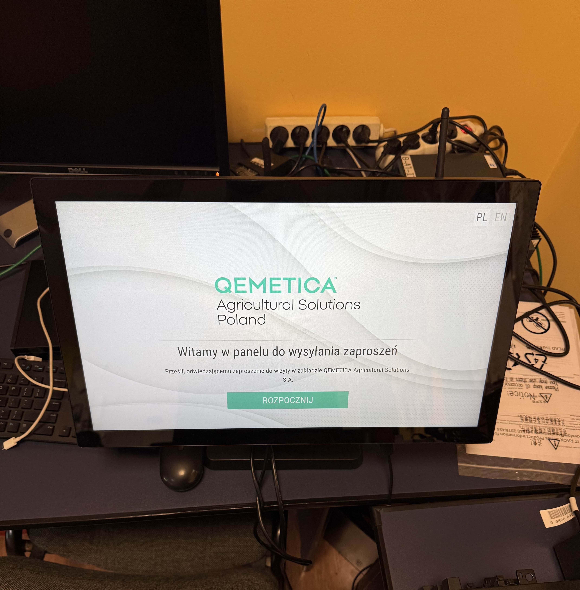

# Qemetica-Internship

# Android Kiosk Launcher

A lightweight **Kiosk Mode app launcher** for Android 8.0+, written in **Java**.  
The app allows locking a selected application in fullscreen kiosk mode with auto-launch on boot and a hidden exit option.  

This solution can be especially useful in specific scenarios, for example:  
- when **WebView is not supported** on the device,  
- when there are **issues with network access certificates** in a corporate environment,  
- or whenever a simple kiosk implementation without WebView dependencies is required.  

---

## ✨ Features

- 🔒 **Kiosk Mode** – selected app runs in fullscreen, preventing user from exiting.  
- ⚡ **Auto-launch after boot** – the chosen app is automatically launched after device restart.  
- 🎯 **Custom position (X, Y)** – define where the target app icon is located on the home screen.  
- 🔄 **Force return** – every attempt to leave the kiosk app triggers an automatic relaunch.  
- 🚪 **Hidden exit option** – tap **20 times** in the bottom-left corner of the screen to quit kiosk mode.  
- 🖱 **Manual start** – from the main panel you can enable kiosk mode for the selected app.  

---

## 🚀 How it works

1. Install and run the app on a device with **Android 8.0+**.  
2. Choose the target app and set its screen coordinates (X, Y).  
3. Start **Kiosk Mode** from the main panel.  
4. The app will automatically handle:  
   - launching after reboot,  
   - relaunching the kiosk app if closed,  
   - restricting user access to the rest of the system.  

---

## 📲 Usage Example

1. Open **MainActivity**.  
2. Pick the target app (e.g., YouTube).  
3. Enter coordinates (X, Y) for its position.  
4. Press **Start Kiosk Mode**.  
5. To exit → tap **20 times** in the bottom-left corner of the device.  

---

## 🛠 Tech Stack

- **Java** (Android SDK)  
- **Android 8.0+** compatibility  
- No WebView dependencies  

---

## 🔐 Use Cases

- Public kiosks  
- Demo devices in stores  
- Digital signage  
- Single-purpose Android terminals  
- Corporate environments with **WebView or certificate-related issues**  

---

## ⚠️ Disclaimer

This project is for **educational and demonstration purposes**.  
Use responsibly – improper use may restrict user access to the device.  

---

## 📄 License

This project is licensed under the **MIT License** – feel free to use, modify and share.  
